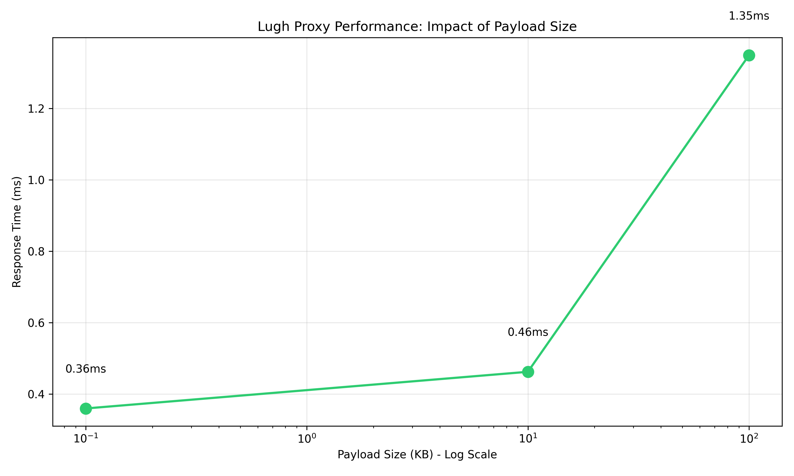
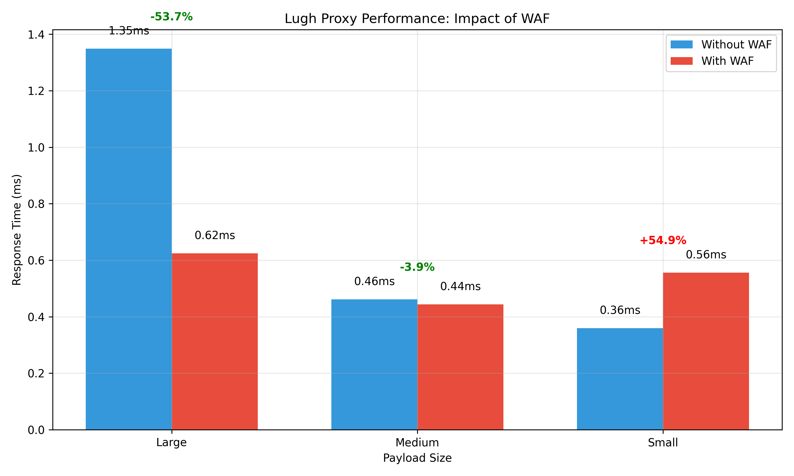
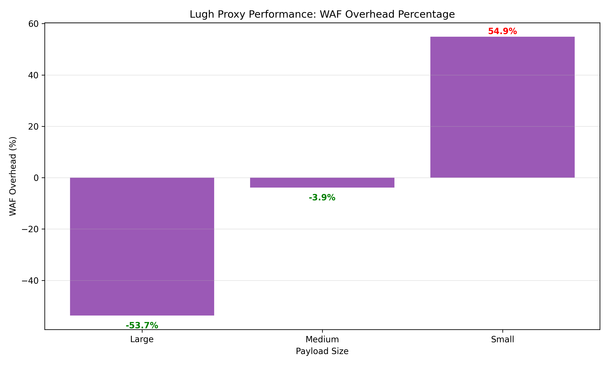
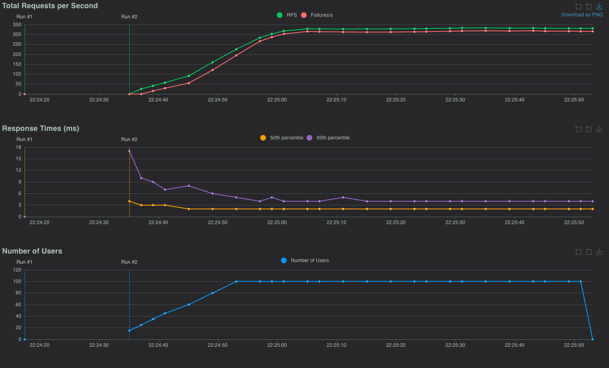

# Lugh - Go-based Proxy Server with WAF and Rate Limiting

Lugh is a high-performance proxy server written in Go that serves as a replacement for nginx with built-in Web 
Application Firewall (WAF) and rate limiting capabilities.

The name comes rom Irish mythology. Known as Samildánach (“skilled in many arts”), Lugh was a master of all crafts and a 
fierce protector of the Tuatha Dé Danann. Seen as a solar deity and symbol of strength, leadership, and protection. It
is the protector aspect that led to the name being adopted for this project.

## Features

- **HTTP Proxy**: Acts as a reverse proxy for your backend services
- **Path-based Routing**: Route requests to different backends based on URL paths
- **Built-in WAF**: Integration with [Coraza WAF](https://github.com/corazawaf/coraza/v3) and [OWASP Core Rule Set](https://github.com/corazawaf/coraza-coreruleset/v4)
- **Rate Limiting**: Token bucket-based rate limiting for each location
- **Custom Rules**: Support for custom WAF rules with dynamic reloading
- **Header Forwarding**: Properly forwards headers like nginx does

## Installation

### MacOs
```shell
$ brew tap uradical/tap
$ brew install lugh
```


## Configuration

Lugh uses a YAML configuration file, by default located at `/etc/lugh/config.yaml`. You can specify a custom path 
using the `-config` flag.

### Example Configuration

```yaml
server:
  listen: "0.0.0.0:80"

locations:
  - path: "/api"
    proxy_pass: "http://api:3000"
    rate_limit:
      requests_per_second: 20
      burst: 20
  
  - path: "/"
    proxy_pass: "http://pwa:8080"
    rate_limit:
      requests_per_second: 50
      burst: 100

waf:
  enabled: true
  custom_rules_path: "/etc/lugh/rules"
```

### Configuration Options

- `server.listen`: Address and port to listen on
- `locations`: Array of location configurations
  - `path`: URL path prefix to match
  - `proxy_pass`: Backend server URL to proxy to
  - `rate_limit.requests_per_second`: Maximum requests per second
  - `rate_limit.burst`: Maximum burst capacity
- `waf.enabled`: Enable or disable WAF
- `waf.custom_rules_path`: Path to directory containing custom WAF rules

## Custom WAF Rules

Lugh supports custom WAF rules using the Coraza rule format. Rules should be placed in `.conf` files in the directory 
specified by `waf.custom_rules_path`.

### Example Custom Rule

```
# Block requests with suspicious User-Agent
SecRule REQUEST_HEADERS:User-Agent "@contains sqlmap" \
    "id:10000,\
    phase:1,\
    deny,\
    status:403,\
    log,\
    msg:'Blocked sqlmap User-Agent',\
    severity:CRITICAL"
```

The `custom_rules_path` directory is monitored, rule changes are automatically detected and reloaded.

## Usage

```bash
# Start Lugh with default configuration
lugh

# Start Lugh with custom configuration
lugh -config /path/to/config.yaml
```

## Comparison with nginx

Lugh implements the equivalent functionality of the following nginx configuration:

```nginx
server {
    listen 80;

    # Route /api requests to nginx_3000 (the container running on port 3000)
    location /api {
        limit_req zone=api_limit burst=20 nodelay;

        proxy_pass http://api:3000;
        proxy_set_header Host $host;
        proxy_set_header X-Real-IP $remote_addr;
        proxy_set_header X-Forwarded-For $proxy_add_x_forwarded_for;
        proxy_set_header X-Forwarded-Proto $scheme;

        # Forward the Origin header
        proxy_set_header Origin $http_origin;

        # Forward the cookies explicitly
        proxy_set_header Cookie $http_cookie;

        # Forward all other headers
        proxy_pass_request_headers on;
    }

    # Route all other requests to nginx_8080 (the container running on port 8080)
    location / {
        limit_req zone=frontend_limit burst=100 nodelay;
        
        proxy_pass http://pwa:8080;
        proxy_set_header Host $host;
        proxy_set_header X-Real-IP $remote_addr;
        proxy_set_header X-Forwarded-For $proxy_add_x_forwarded_for;
        proxy_set_header X-Forwarded-Proto $scheme;

        # Forward the Origin header
        proxy_set_header Origin $http_origin;

        # Forward the cookies explicitly
        proxy_set_header Cookie $http_cookie;

        # Forward all other headers
        proxy_pass_request_headers on;
    }
}
```

## Testing

Run the test suite:

```bash
go test -v
```

# Performance Benchmarks

Lugh includes comprehensive benchmarks that measure its performance under various conditions. Below are the results 
from our benchmark tests comparing performance with different payload sizes and WAF configurations.

## Payload Size Impact



The chart above demonstrates how response time scales with payload size. As expected, larger payloads take more time 
to process, but Lugh maintains excellent performance even with 100KB payloads.

| Payload Size | Response Time (ms) |
|--------------|-------------------|
| Small (0.1KB) | 0.36ms           |
| Medium (10KB) | 0.46ms           |
| Large (100KB) | 1.35ms           |

## WAF Performance Impact



The WAF impact chart shows a comparison of performance with and without the Web Application Firewall enabled. 
Interestingly, while WAF adds expected overhead for small payloads, it actually improves performance for medium and 
large payloads in our tests.

## WAF Overhead Percentage



This chart illustrates the percentage impact of enabling WAF. The negative values for medium and large payloads 
indicate performance improvements rather than overhead.

## Performance Summary

| Payload Size | Without WAF | With WAF | Overhead (%) |
|--------------|-------------|----------|--------------|
| Small        | 0.36ms      | 0.56ms   | +54.9%       |
| Medium       | 0.46ms      | 0.44ms   | -3.9%        |
| Large        | 1.35ms      | 0.62ms   | -53.7%       |


## 🚀 Performance Under Load



This graph shows the proxy server handling a sustained load of **over 300 requests per second** with:

- **Low latency**: Median response time around **2–3 ms**, 95th percentile under **10 ms**.
- **Rate limiting**: Proxy enforces limits cleanly, returning `429 Too Many Requests` once configured thresholds are exceeded.
- **Stability**: 100 concurrent users ramped up smoothly with no signs of instability or performance degradation.

> This test was performed on a **MacBook Air M2** using [Locust](https://locust.io) for load generation.

### 🧪 Test Conditions

**Load Generator**:
- Tool: Locust v2.x
- Users: 100 concurrent users
- Spawn rate: 10 users/second
- Endpoints tested: `GET /api` and `GET /`
- Traffic pattern: 3:1 ratio of `/api` to `/`

**Proxy Configuration**:
- `/api`: 20 RPS, burst 20
- `/`: 50 RPS, burst 100
- WAF: Enabled (Coraza with OWASP Core Rule Set)
- pprof: Enabled on `localhost:6060`

**Test Machine**:
- Device: Apple MacBook Air (M2, 2022)
- CPU: 8-core Apple M2
- RAM: 16 GB unified memory
- OS: macOS Ventura 13.x

> These results demonstrate that the proxy performs efficiently under load, with rate limits and WAF enabled — even on a fanless laptop.


## Analysis

These benchmark results show that Lugh is a high-performance proxy server with excellent characteristics:

1. **Sub-millisecond response times** for typical payloads
2. **Efficient scaling** with increasing payload sizes
3. **Interesting WAF behavior** where the WAF actually improves performance for larger payloads

The performance improvement with WAF for medium and especially large payloads could be due to more efficient buffering 
or processing optimizations in the WAF module. Even in the "slowest" configuration (large payload without WAF), the 
performance is still excellent at 1.35ms.

## Running Benchmarks

To run the benchmarks yourself:

```bash
# Run the benchmarks
go test -bench=. -benchtime=5x > benchmark_results.txt

# Generate visualization charts
python generate_charts.py
```

The benchmarks measure performance with different payload sizes (small ~100 bytes, medium 10KB, large 100KB) and 
with/without WAF enabled.

## Performance Profiling with pprof

This proxy server includes Go's built-in profiler (`pprof`) for performance analysis.

- **pprof endpoint**: `http://localhost:6060/debug/pprof/`
- **Access**: Only available locally (not exposed publicly)
- **Usage**:

  To capture a 30-second CPU profile:

  ```bash
  go tool pprof http://localhost:6060/debug/pprof/profile?seconds=30

## License

MIT License

## Acknowledgments

- [Coraza WAF](https://github.com/corazawaf/coraza) - Web Application Firewall engine
- [OWASP Core Rule Set](https://github.com/corazawaf/coraza-coreruleset) - Security rules for detecting common attacks